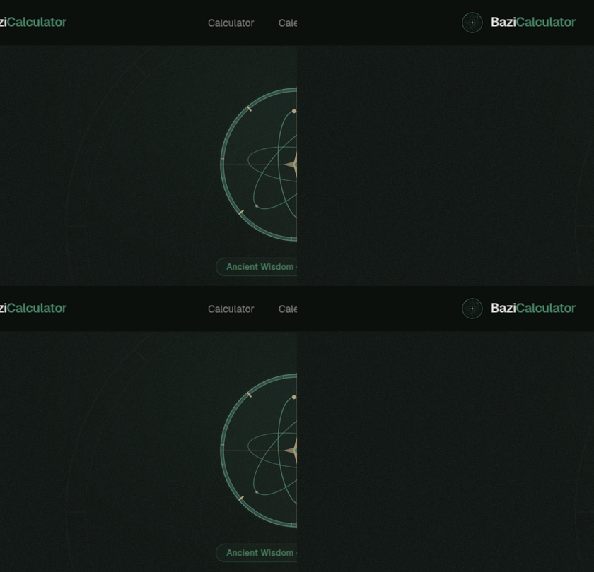

# 🌟 BaziCalculator.ai

### Free Bazi Calculator — AI-Powered Four Pillars of Destiny Readings

 

### 👉 **[Launch the Free Bazi Calculator →](https://www.bazicalculator.ai)**

---

## What is Bazi?

**Bazi (八字)**, also known as the **Four Pillars of Destiny**, is a classical
form of Chinese astrology that maps your birth date, time, and location into
four pillars of **Heavenly Stems (天干)** and **Earthly Branches (地支)**.

Unlike Western sun-sign astrology, Bazi is built on **astronomical calendar
data**, so the exact minute and longitude of your birth matter — making it
remarkably precise. Around the chart, the **Five Elements (五行)** — Wood, Fire,
Earth, Metal, and Water — interact through generating and controlling cycles to
reveal patterns in your personality, career, relationships, and life path.

BaziCalculator.ai turns this ancient system into a modern, instant, AI-assisted
reading — **no login required**.

---

## ✨ Features

- **⚡ Instant Free Chart** — Generate your Four Pillars (Year, Month, Day, Hour) the moment you enter your birth details. No account, no paywall.
- **🕐 True Solar Time Correction** — Bazi uses the sun's actual position, not clock time. The engine applies longitude-based true solar time so your Hour Pillar is always accurate.
- **🤖 AI Destiny Readings** — Gemini-powered interpretations of your Day Master (日主), elemental balance, and hidden stems — written in plain English.
- **📚 Built-in Glossaries** — Plain-English explanations of the Five Elements, ten Heavenly Stems, and twelve Earthly Branches, right on the page.
- **🎨 Polished, Accessible UI** — Light & dark themes, responsive design, and an armillary-sphere motif inspired by classical Chinese astronomy.

---

## 🔗 Links

| | |
|---|---|
| 🌐 **Website** | **[https://www.bazicalculator.ai](https://www.bazicalculator.ai)** |
| 📖 **FAQ** | [bazicalculator.ai/faq](https://www.bazicalculator.ai/faq) |
| ℹ️ **About** | [bazicalculator.ai/about](https://www.bazicalculator.ai/about) |

---

## 🛠️ Tech Stack (overview)

This is a **landing repository**. The application source code is kept private.
A high-level overview of what powers the live site:

- **Frontend** — Next.js (App Router, SSG-first) on Vercel
- **Charting Engine** — `tyme4ts` astronomical calendar lookup (TypeScript, offline)
- **AI Readings** — Gemini large language model with a chart-snapshot guardrail that keeps multi-turn readings self-consistent
- **Backend** — Supabase (accounts & billing)

> **SEO note:** the homepage is statically generated (SSG) so crawlers receive
> the full H1, meta tags, FAQ content, and JSON-LD structured data in the first
> HTML response — no JavaScript hydration required.

---

## ❓ FAQ

**Is the Bazi calculator really free?**
Yes. Chart generation is free with no sign-up. Optional AI readings are offered
as an upgrade.

**How accurate is the chart?**
The calculator uses the `tyme4ts` astronomical calendar library and applies
true solar time correction based on your birth city's longitude.

**Do I need to know my exact birth time?**
The more precise the better — especially for the Hour Pillar. A city is enough
for the solar-time correction; the exact minute sharpens the reading.

---

**Made with ☯ and a lot of caffeine.**

### 👉 **[Try the Free Bazi Calculator →](https://www.bazicalculator.ai)**

